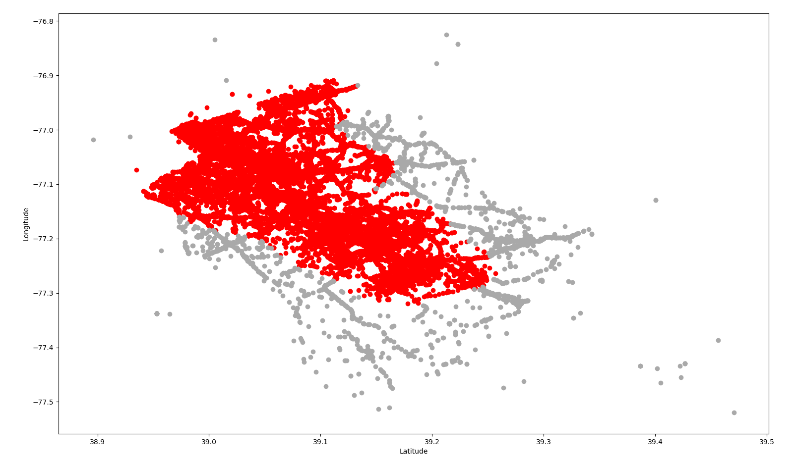
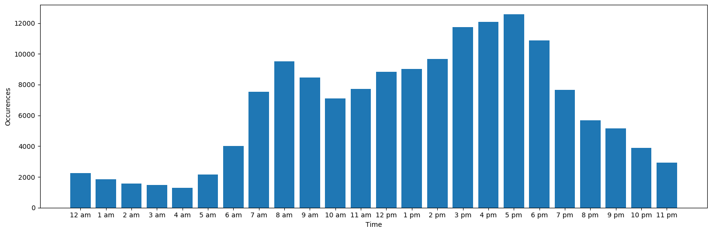
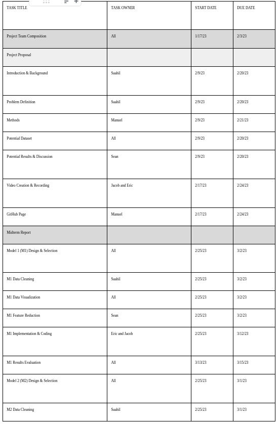
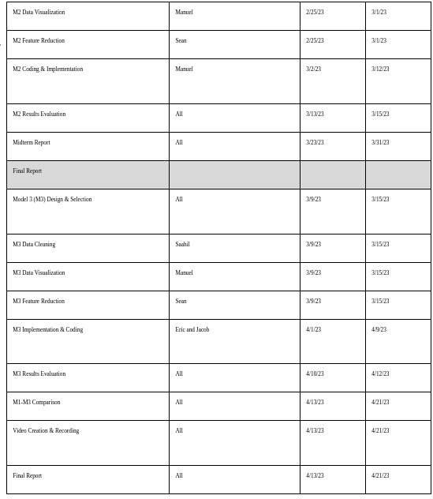
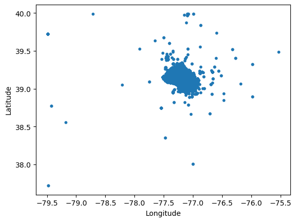
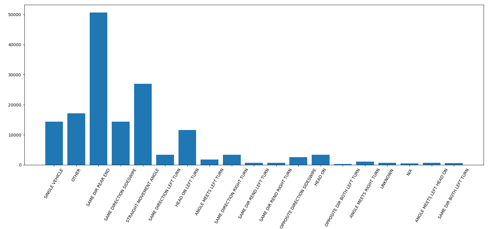
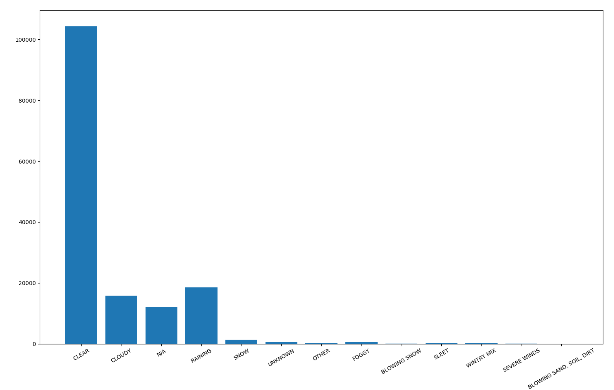
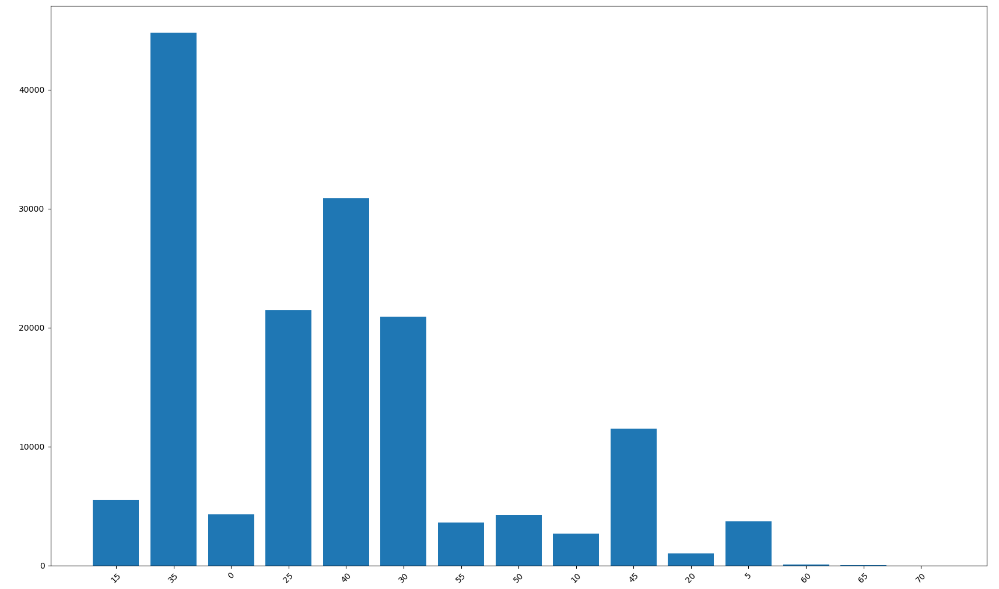

# Accident Risk Assessor

A machine learning project that predicts car accident risk in Maryland using 155,108 data points from the Montgomery County crash reporting dataset. The system analyzes situational factors (weather, road conditions, traffic) and static features (vehicle condition) to provide personalized accident risk assessments.

## 🎯 Project Overview

As of 2018, global annual road traffic deaths reached 1.35 million, with 38,000 fatalities and $55 billion in associated costs in the United States alone. This project develops a car accident risk assessor for Maryland to help predict and potentially prevent accidents.

**🎥 Project Presentation**: [YouTube Video](https://www.youtube.com/watch?v=FM7b4zGDyb0)
## 📊 Dataset

- **Source**: [Montgomery County Crash Reporting Data](https://catalog.data.gov/dataset/crash-reporting-drivers-data)
- **Size**: 155,108 data points
- **Coverage**: Baltimore, Maryland area
- **Features**: 28 original features reduced to 5 using PCA (retaining 99% variance)

## 📚 Research Context

This project builds upon existing literature:
- **Wilson (2018)**: Utah dataset analysis highlighting real-time data importance and geographic risk mapping
- **Cigdem et al. (2018)**: Class imbalance solutions and confusion matrix evaluation methods
- **Al-Mistarehi et al. (2022)**: Performance measurement methodologies for traffic crash prediction

Based on corroboration found in the literature on the importance of real-time data, we developed models that can provide personalized risk assessments given real-time location, driver, and weather details.
## 🏗️ Project Structure

```
Accident-Risk-Assessor/
├── data/                           # Dataset and preprocessing
│   ├── Accident Data/             # Processed datasets
│   ├── Scripts/                   # Data processing scripts
│   ├── balanced_data.csv          # Random sampling method dataset
│   └── balanced_nonrandom_data.csv # Non-random sampling method dataset
├── modelling/                     # Machine learning models
│   ├── randomforest.py           # Random Forest implementation
│   ├── gbdt.py                   # XGBoost implementation
│   ├── neural-net.py             # Neural Network implementation
│   └── location-dbscan.py        # DBSCAN clustering
├── visualizations/               # Data analysis and charts
│   ├── single_feature_bar_graphs/ # Feature frequency analysis
│   ├── scatter_plots/            # Geographic crash distribution
│   └── frequency_finder.py       # Visualization utilities
├── images/                       # Project documentation images
└── index.html                    # Web presentation
```

## 📈 Methodology

### 1. Data Preprocessing
- **Feature Selection**: Removed post-accident features (collision severity, driver fault, etc.) to focus on predictive rather than descriptive information
- **Dimensionality Reduction**: Applied PCA to reduce from 28 to 5 features while retaining 99% of variance
- **Data Cleaning**: Standardized categorical variables and handled missing values

The PCA data is available in: `data/Accident Data/Accident_PCA_Data.csv`
### 2. Non-Accident Data Generation
To address class imbalance, we implemented two approaches for generating synthetic non-accident data:

**Method 1: Random Sampling**
- Randomly select accident record as base
- Alter one of: road segment, hour of day, or day of year
- Generate 3x more non-accident than accident samples (75% vs 25%)
- Available in: `data/balanced_data.csv`

**Method 2: Non-Random Sampling** 
- Use realistic probability distributions for features
- Maintain feature relationships (e.g., Vehicle Make ↔ Vehicle Model)
- Account for real-world patterns (rush hour timing, weather distributions)
- Available in: `data/balanced_nonrandom_data.csv`
### 3. Machine Learning Models

#### Unsupervised Learning
- **DBSCAN Clustering**: Location-based risk zone identification
  - Parameters: ε=0.03, min_points=1000
  - Applied to latitude/longitude coordinates
  - Result: Single cluster following Baltimore geography

#### Supervised Learning
1. **Random Forest Classifier**
   - 100 estimators, handles mixed data types
   - Robust against overfitting
   - Suitable for imbalanced datasets
   - Implementation: `modelling/randomforest.py`

2. **XGBoost (Gradient Boosted Decision Trees)**
   - High-performance gradient boosting
   - Tested with and without PCA preprocessing
   - Implementation: `modelling/gbdt.py`

3. **Neural Network**
   - 2-layer architecture: [27→1] neurons
   - Activation: tanh (hidden), ReLU (output)
   - Optimizer: Stochastic Gradient Descent
   - Training: 3 epochs
   - Implementation: `modelling/neural-net.py`

## 🛠️ Installation

### Prerequisites
- Python 3.7+
- Required packages:
```bash
pip install pandas numpy scikit-learn xgboost tensorflow matplotlib seaborn
```

### Setup
1. Clone the repository:
```bash
git clone https://github.com/yourusername/Accident-Risk-Assessor.git
cd Accident-Risk-Assessor
```

2. Install dependencies:
```bash
pip install -r requirements.txt  # You may need to create this file
```
## 🚀 Usage

### Running Models

**Random Forest:**
```bash
cd modelling
python randomforest.py
```

**XGBoost:**
```bash
cd modelling
python gbdt.py
```

**Neural Network:**
```bash
cd modelling
python neural-net.py
```

**DBSCAN Clustering:**
```bash
cd modelling
python location-dbscan.py
```

### Data Processing
```bash
cd data/Scripts
python pca.py                    # Apply PCA transformation
python nonaccidentscript.py     # Generate non-accident data
```

### Generating Visualizations
```bash
cd visualizations
python frequency_finder.py      # Create feature frequency charts
```
## 📊 Results

### Model Performance Comparison

| Model | Dataset | Accuracy | Precision | Recall | Notes |
|-------|---------|----------|-----------|--------|-------|
| Random Forest | Balanced Random | 67.7% | - | 0.90 (non-accident), 0.02 (accident) | Poor accident detection |
| Random Forest | Balanced Non-Random | **98.0%** | - | 0.99 (non-accident), 0.95 (accident) | Excellent performance |
| XGBoost | Balanced Random | 71.6% | 0.40 | 0.17 | Struggles with accidents |
| XGBoost | Balanced Non-Random | **95.0%** | - | Balanced performance | Strong improvement |
| Neural Network | Balanced Random | 75.0% | - | - | Moderate performance |
| Neural Network | Balanced Non-Random | 75.0% | - | - | Consistent across datasets |
| Neural Network | PCA Data | 50.0% | - | - | PCA degraded performance |

### Key Findings
- **Non-random sampling significantly outperforms random sampling** across all models
- Random Forest achieved the best performance (98% accuracy) with non-random data
- XGBoost showed dramatic improvement with non-random data
- Neural networks maintained consistent ~75% accuracy regardless of dataset
- PCA preprocessing hurt neural network performance

### DBSCAN Clustering Results

*Geographic clustering shows single cluster following Baltimore area geography (ε=0.03, min_points=1000)*
### Visualizations


*Rush hour peaks clearly visible in accident timing - this insight informed our non-random sampling approach*

## 🔄 Future Improvements

1. **Enhanced Non-Accident Data Generation**
   - Improve randomization process based on literature best practices
   - Better distinguish positive vs negative examples on high-frequency roads

2. **Geographic Expansion**
   - Extend beyond Baltimore/Maryland to prevent location-specific overfitting
   - Test model generalization across different regions

3. **Additional Models**
   - Implement deep learning architectures
   - Explore ensemble methods combining multiple approaches
   - Real-time prediction capabilities

4. **Feature Engineering**
   - Incorporate more real-time data sources
   - Add weather API integration
   - Include traffic density metrics

## 🎓 Conclusions

Through the implementation of this project, our team was able to work with multiple machine learning models on a real-world dataset. Observing the various accuracies and metrics of our different models allowed us to create a greater understanding of machine learning concepts and the importance of data quality in model performance.

Key learnings include:
- The critical impact of non-accident data generation methods on model performance
- The challenges of working with imbalanced datasets in real-world scenarios
- The importance of feature engineering and domain knowledge in ML projects

## 🤝 Contributors




## 📄 References

1. World Health Organisation. Global status report on road safety 2018; 17th June 2018; Available at https://www.who.int/publications/i/item/9789241565684
2. Centers for Disease Control and Prevention. WISQARS (Web-based Injury Statistics Query and Reporting System) [online]; 2020. Available at https://www.cdc.gov/injury/wisqars/index.html
3. Daniel Wilson. Using Machine Learning to Predict Car Accident Risk; 3rd May 2018; Available at https://medium.com/geoai/using-machine-learning-to-predict-car-accident-risk-4d92c91a7d57
4. Cigdem, A., and Cevher Ozden. "Predicting the severity of motor vehicle accident injuries in Adana-Turkey using machine learning methods and detailed meteorological data." Int. J. Intell. Syst. Appl. Eng 6.1 (2018): 72-79.
5. Al-Mistarehi, B. W., et al. "Using machine learning models to forecast severity level of traffic crashes by r studio and arcgis. front." Machine Learning Applications in Civil Engineering 16648714 (2022): 31.

## 📊 Appendix: Additional Visualizations

### Geographic Distribution

*Geographic distribution of crashes in Baltimore area*

### Feature Analysis

*Distribution of collision types*


*Weather conditions during crashes*


*Speed limit distribution at crash locations*

---

**Note**: This project was developed as part of a machine learning course and demonstrates various ML techniques applied to real-world crash data. The models show promising results but require further validation before deployment in safety-critical applications.
